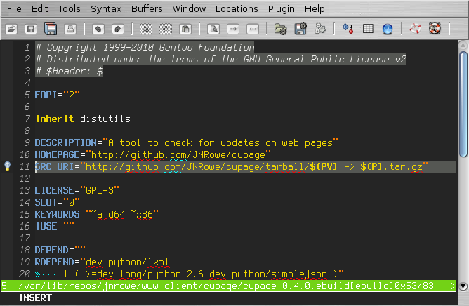
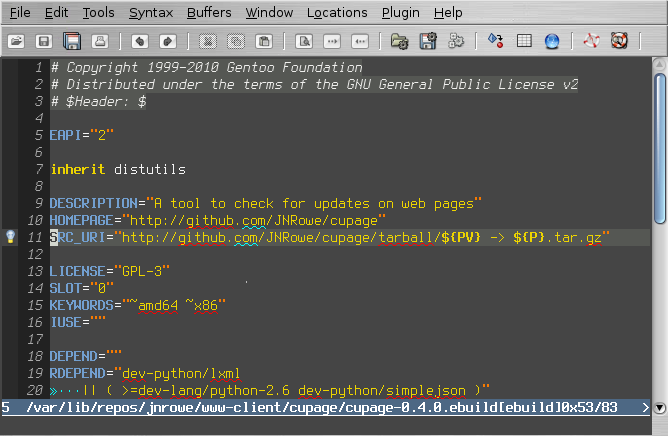
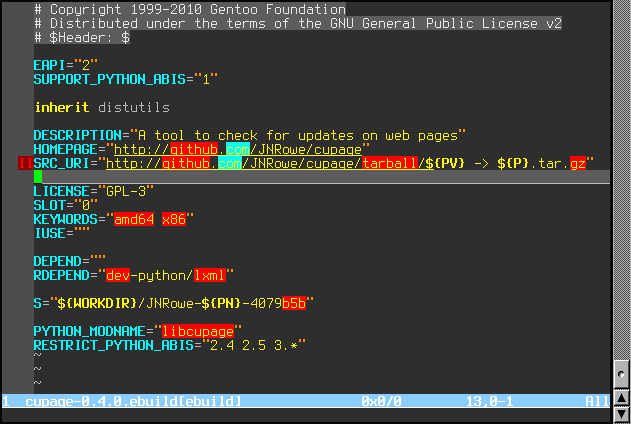

.. _vim-jnrowe-label:

``vim-jnrowe`` colourscheme
===========================

What the vim_ world *really* needed is another colourscheme, so here it is.

If you prefer lighter backgrounds, use the following:

.. code-block:: vim

    let g:jnrowe_dark = 0
    colorscheme jnrowe

With ``g:jnrowe_dark`` set it will look more like this:

Recent versions also work in terminals that support at least 88 colours, such as
rxvt-unicode_ or xterm_.  The display is highly dependent on the settings of
your terminal application, on my desktop it looks like this:

Contact
-------

You can contact me with comments by email_.

File an issue_ if you find any problems, or fork_ the repository if you want to
make improvements.

Download
--------

You can download the colourscheme directly_, or clone the repository::

    $ git clone git://github.com/JNRowe/vim-jnrowe

.. _vim: http://www.vim.org/
.. _rxvt-unicode: http://software.schmorp.de/pkg/rxvt-unicode.html
.. _xterm: http://dickey.his.com/xterm/
.. _email: jnrowe@gmail.com
.. _issue: https://github.com/JNRowe/vim-jnrowe/issues
.. _fork: http://github.com/JNRowe/vim-jnrowe
.. _directly: http://github.com/JNRowe/vim-jnrowe/raw/master/colors/jnrowe.vim
